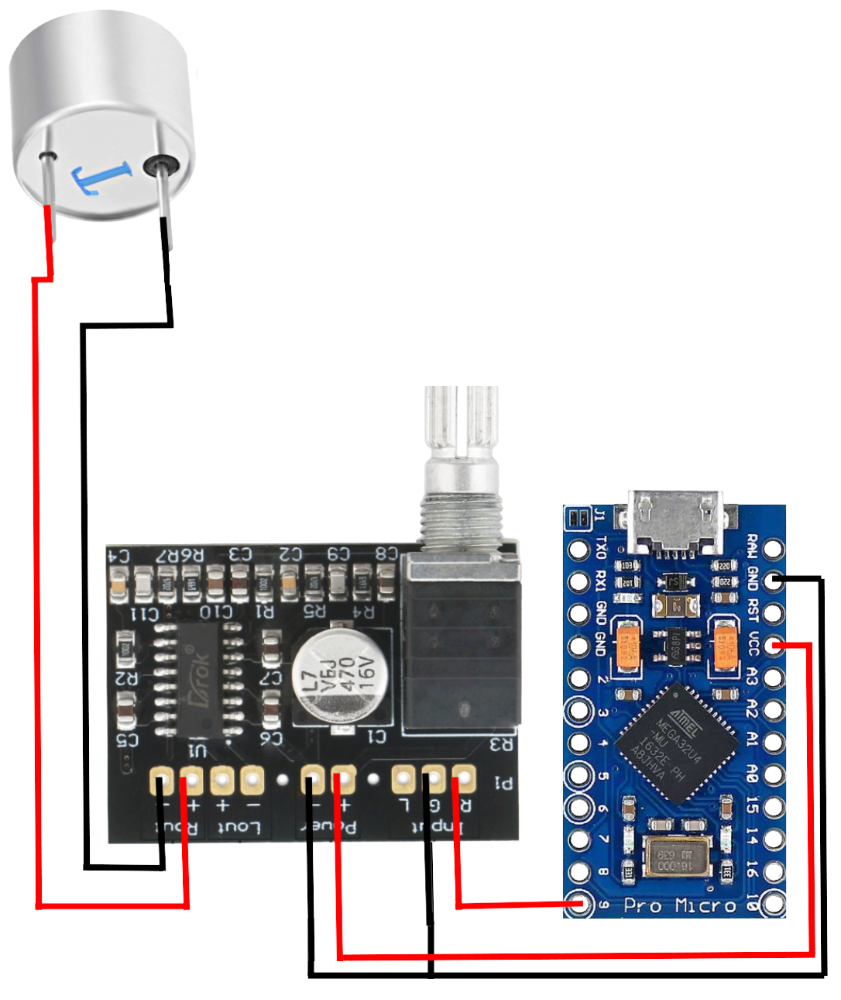
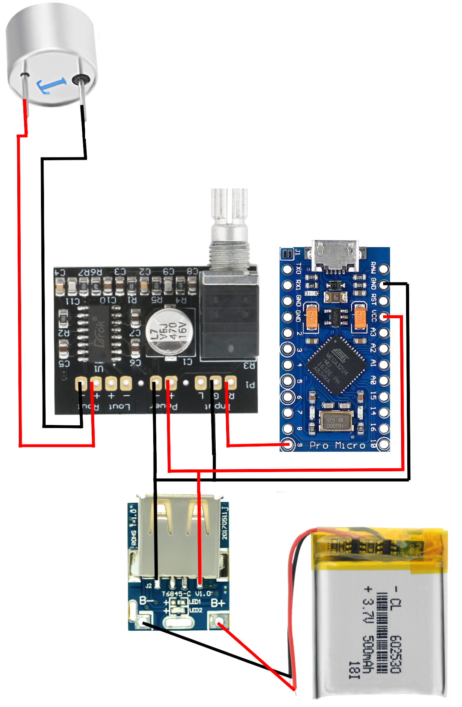
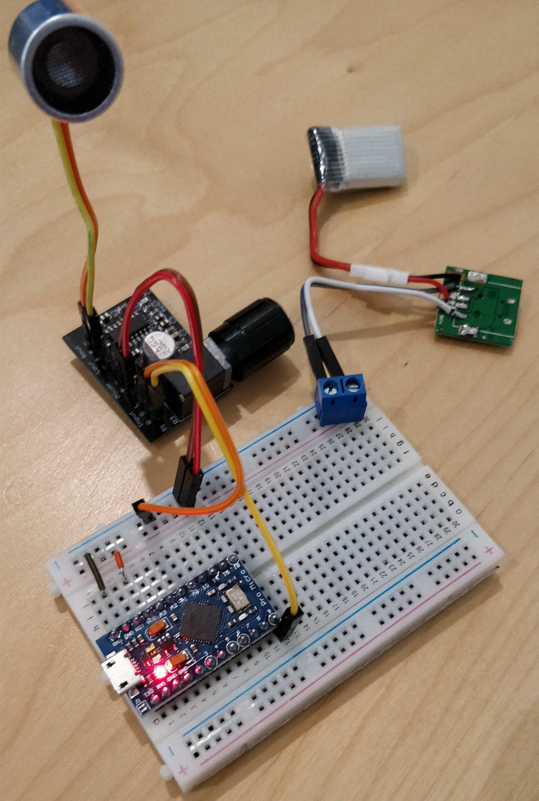

# Amazon Echo (Alexa) and Google Home jammer for Arduinos and chips like the ESP8266 and ESP32

This project is still under development and has not been tested very well yet.

## Structure

This project consists of two parts. The first one we're calling the `mic-jammer` and the second one we're calling the `wifi-jammer`.

## The "wifi-jammer"

It constantly checks if there are any spy devices around you, such as an Amazon Echo or a Google Home device and blocks their WiFi access. (Other devices are left alone.)

Beware, this automatically works on ALL Wifi networks in your range (even hidden ones) without even knowing the wifi passwords.
Make sure you're not breaking any laws in whatever country you want to operate such a jamming device!

The wifi-jammer requires a an ESP8266 or ESP32.

## The "mic-jammer"

The "mic-jammer" generates ultrasonic noise that is inaudible to humans. Microphones however get jammed by the noise making any recordings useless. Filtering out the noise in software does not appear to be possible as the noise completely overpowers anything else and the microphone actually picks it up as humanly audible noise (20hz-20khz) instead of 20khz+.

Beware, the mic-jammer will jam all microphones in range.
Make sure you're not breaking any laws in whatever country you want to operate such a jamming device!

The "mic-jammer" requires an Arduino.

## How to use the "wifi-jammer"

- If you haven't already, [Install the Arduino IDE](https://www.arduino.cc/en/main/software), [add the ESP8266 board to your Arduino IDE](https://github.com/esp8266/Arduino#installing-with-boards-manager) and restart the IDE.
- Open the `wifi-jammer.ino` file with your Arduino IDE.
- Connect your ESP8266 to your computer.
- Select your ESP8266 board unter `Tools->Board` and `Tools->Port`
- Click the upload button.

If you want to make it portable, ESP8266 boards like [this one](https://www.aliexpress.com/item/32973629392.html) are nice because you can simply pop in an 18650 battery to make it portable. But a [Wemos D1](https://www.aliexpress.com/item/32845084675.html) with a power bank works just as well.

## How to use the "mic-jammer"

#### Software
- If you haven't already, [Install the Arduino IDE](https://www.arduino.cc/en/main/software)
- Open the `mic-jammer.ino` file with your Arduino IDE.
- Connect your Arduino to your computer.
- Select your board unter `Tools->Board` and `Tools->Port`
- You might also want to adjust the FREQUENCY_MIN and FREQUENCY_MAX variables in the code. For example if you use a 25khz transducer, you would probably want to set them to 24000 and 26000.
- Click the upload button.

#### Hardware
Parts:
- [TCT40-16T](https://www.aliexpress.com/item/32258563531.html) (40khz, range is pretty poor ~1 meter) You might be better off buying [25khz transmitters](https://www.aliexpress.com/item/1673244251.html) (I haven't received my 25khz ones yet, so I couldn't test it so far.)
- [PAM8403 Mini Power Amplifier Board 3Wx2 (3-5.5V 4Ω)](https://www.droking.com/PAM8403-Power-amplifier-circuit-Board-Small-Audio-Amplifier-3W-3W-Digital-Amplifier-Board-Support-USB-Power-Supply) (You can probably use way cheaper ones [like this](https://www.aliexpress.com/item/33016370875.html), but I ahven't tested that yet.)
- [Arduino Pro Micro 5V](https://www.aliexpress.com/item/32768308647.html)
- [500mAh 3.7V LiPo](https://www.aliexpress.com/item/33019024577.html) (Any LiPo with 2 wires will do. More mAh = longer run time.)
- [Charging board with integrated 5v step up converter](https://www.aliexpress.com/item/32819047141.html)

Stationary setup:

Portable setup:

Photo of portable setup:

## Any questions?
Feel free to open an issue on this GitHub repo

## Credits
The "wifi-jammer" of this project is heavily based on [RandDruid's esp8266-deauth](https://github.com/RandDruid/esp8266-deauth).  
The "mic-jammer" of this project is heavily based on [y-x-c's wearable-microphone-jamming](https://github.com/y-x-c/wearable-microphone-jamming).
